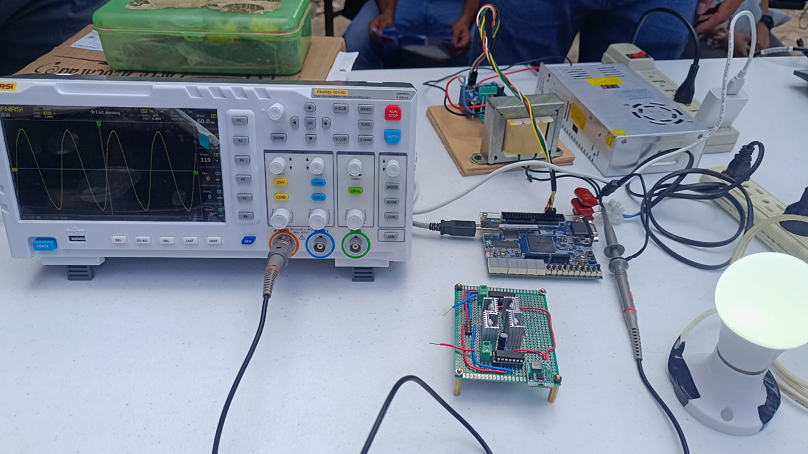
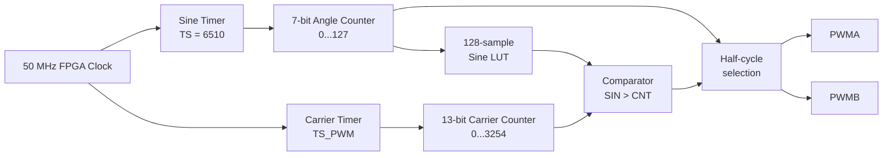
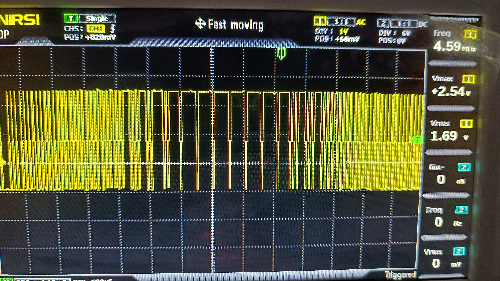
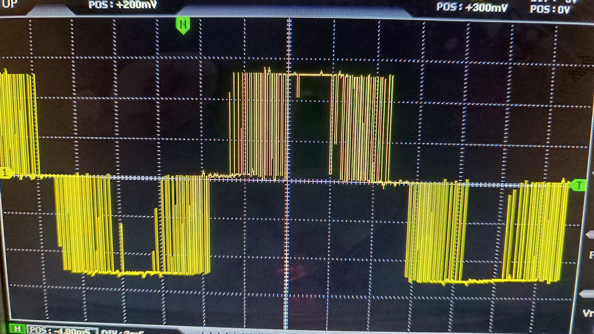
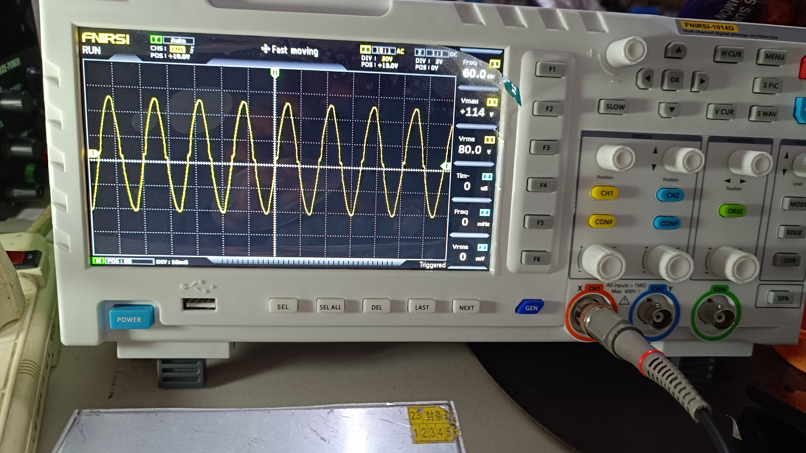
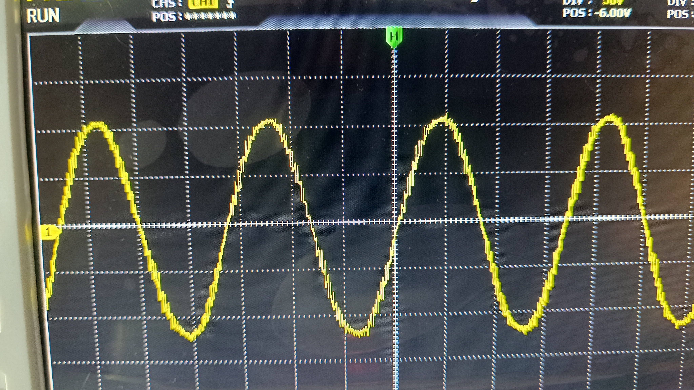

# FPGA SPWM Sine-Wave Inverter

Single-phase DC-AC inverter controlled by an **Intel MAX 10 FPGA** using sinusoidal pulse-width modulation (**SPWM**).

The project was designed to convert a low-voltage DC supply into approximately **120 V AC RMS at 60 Hz**. The FPGA generates the SPWM switching signals in VHDL, an external H-bridge performs the power switching, and a transformer steps the voltage up to the output level.

The project includes the complete VHDL source code, Quartus Prime project, analytical calculations, original technical report, experimental measurements, and photographs of the working prototype.

## Key Results

| Parameter | Value |
|---|---:|
| Nominal DC input | 24 V |
| Target AC output | 120 V RMS |
| Output frequency | 60 Hz |
| FPGA clock | 50 MHz |
| Sine LUT | 128 samples |
| LUT address width | 7 bits |
| Design PWM carrier | 15.36 kHz |
| Test load | 10 W LED lamp |
| Measured output | 120.03 V RMS |
| Experimental efficiency | **89.97%** |

<p align="center">
  
</p>

---

## Project Overview

The objective of the project was to implement a single-phase inverter in which the modulation is generated digitally inside an FPGA.

Rather than generating a fixed-duty PWM waveform, the duty cycle follows a discretized sinusoidal reference stored in a lookup table. This SPWM signal controls the H-bridge power stage so that the low-frequency component of the switched waveform follows a 60 Hz sinusoidal envelope.

The complete conversion chain is:

```text
Low-voltage DC
      │
      ▼
   H-Bridge
      │
      │ SPWM switched waveform
      ▼
Step-up Transformer
      │
      ▼
≈ 120 V AC RMS
      │
      ▼
     Load
```

The FPGA is responsible for:

- generating the 60 Hz sinusoidal reference;
- generating the high-frequency carrier;
- comparing both signals;
- producing the two SPWM outputs;
- selecting the appropriate half-cycle;
- providing enable signals for the power stage.

---

## System Architecture

### Digital SPWM Generation



The implementation is separated into reusable VHDL entities instead of placing the complete SPWM generator in a single process.

---

## VHDL Architecture

The top-level entity is:

```text
SPWM.vhd
```

It integrates four additional modules:

| Module | Function |
|---|---|
| `Timer.vhd` | Generates periodic synchronization pulses from the FPGA clock |
| `Counter.vhd` | Generates the 7-bit sine-LUT address |
| `SineLut.vhd` | Stores the discretized sinusoidal magnitude |
| `CounterX.vhd` | Generates the high-frequency ramp/carrier |
| `SPWM.vhd` | Compares sine and carrier signals and generates `PWMA` / `PWMB` |

### Top-Level Signal Flow

The comparator implements:

```text
PWM = 1  when  SIN > CNT
PWM = 0  otherwise
```

The most significant bit of the angle counter determines which output is active:

```text
First half-cycle  → PWMA active
Second half-cycle → PWMB active
```

This allows the two polarities of the output waveform to be controlled during alternating half-cycles.

The FPGA also provides:

```text
REN = ENI
LEN = ENI
```

for enabling the power stage.

---

## Sine-Wave Generation

### LUT Resolution

The sinusoidal reference contains:

```text
N = 128 samples
```

Therefore, the LUT requires:

```text
log2(128) = 7 bits
```

The angular resolution is:

```text
360° / 128 = 2.8125° per sample
```

or approximately:

```text
0.049087 rad/sample
```

The `SineLut` output uses a **13-bit bus**.

The maximum stored magnitude is:

```text
3000
```

while the carrier counter reaches:

```text
3254
```

The reference therefore uses approximately:

```text
3000 / 3254 ≈ 92.2%
```

of the available carrier amplitude.

This margin prevents the sine reference from exceeding the carrier and helps avoid clipping of the SPWM waveform.

---

## 60 Hz Timing Calculation

For:

```text
FPGA clock = 50 MHz
Output frequency = 60 Hz
Samples = 128
```

the required LUT update frequency is:

```text
60 × 128 = 7680 samples/s
```

The theoretical timer count is:

```text
50,000,000 / 7680 ≈ 6510.42
```

The implemented value is:

```text
TS = 6510
```

which gives an output frequency of approximately:

```text
50,000,000 / (6510 × 128)
≈ 60.004 Hz
```

This is very close to the 60 Hz design target.

---

## SPWM Carrier

`CounterX.vhd` implements a 13-bit ramp that counts:

```text
0 → 3254
```

and then restarts.

With the original 50 MHz clock and one carrier-count update per FPGA clock:

```text
f_carrier =
50,000,000 / 3255
≈ 15.361 kHz
```

This corresponds to the approximately **15.36 kHz SPWM carrier frequency used in the original design calculations**.

### Preserved VHDL Configuration

The current preserved top-level VHDL contains:

```vhdl
TS_PWM : integer := 2
```

and uses a second timer to control the carrier-counter update.

Therefore, with the current default:

```text
f_carrier ≈
50,000,000 / (3255 × 2)
≈ 7.680 kHz
```

To reproduce the original approximately 15.36 kHz carrier directly from the preserved implementation:

```text
TS_PWM = 1
```

This difference is intentionally documented because the repository preserves a later experimental version of the VHDL as well as the original analytical design.

---

## FPGA Target and Quartus Configuration

The Quartus project targets:

| Parameter | Configuration |
|---|---|
| FPGA family | Intel MAX 10 |
| Device | `10M50DAF484C7G` |
| Top-level entity | `SPWM` |
| Quartus version | 25.1 |
| HDL | VHDL |

### Pin Assignments

| Signal | FPGA Pin | Function |
|---|---|---|
| `CLK` | `PIN_P11` | 50 MHz system clock |
| `RST` | `PIN_B8` | Active-low reset |
| `ENI` | `PIN_C10` | Power-stage enable input |
| `REN` | `PIN_AA7` | Enable output |
| `LEN` | `PIN_Y6` | Enable output |
| `PWMA` | `PIN_Y5` | SPWM output A |
| `PWMB` | `PIN_AA6` | SPWM output B |

The repository version of `SPWM.qsf` uses relative paths to the VHDL sources so that the Quartus project can be cloned and opened on another computer without depending on the original development-directory structure.

---

## Power Stage

The digital SPWM signals generated by the FPGA control an external **full H-bridge**.

The H-bridge is responsible for applying alternating polarity to the transformer input according to the SPWM sequence.

Conceptually:

```text
                FPGA
          PWMA / PWMB
               │
               ▼
        ┌─────────────┐
 DC ───►│   H-Bridge  │
        └──────┬──────┘
               │
               │ SPWM power waveform
               ▼
        ┌─────────────┐
        │ Transformer │
        └──────┬──────┘
               │
               ▼
          High-voltage AC
```

The transformer provides:

- voltage step-up;
- galvanic isolation between the low-voltage DC side and the output side.

The original design target was:

```text
24 V DC → 120 V AC RMS
```

---

## Output Filtering

An LC low-pass filter was analyzed as part of the inverter design to attenuate the high-frequency switching components while preserving the 60 Hz fundamental.

The design criterion considered a cutoff frequency:

- sufficiently above the 60 Hz fundamental;
- sufficiently below the SPWM carrier frequency.

However, the original project documentation is not completely consistent about the final physical implementation of this filter: the methodology discusses LC filtering, while the final conclusions also identify implementation/improvement of the LC filter as future work.

For that reason, this repository **does not claim a fully characterized final LC output filter or measured filter frequency response**.

The associated calculations are preserved in:

```text
calculations/Inversor_SPWM_Calculos.xlsx
```

---

## Experimental Testing

The inverter was tested using an LED lamp as the load.

### Final Load Test

| Measurement | Experimental Value |
|---|---:|
| DC input voltage | 27.7 V |
| DC input current | 0.38 A |
| Input power | ≈ 10.526 W |
| AC output voltage | 120.03 V RMS |
| AC output current | 0.0789 A |
| Output power | ≈ 9.470 W |
| Load | 10 W LED lamp |

The experimental efficiency was calculated as:

```text
η = Pout / Pin × 100
```

therefore:

```text
η =
(120.03 × 0.0789) /
(27.7 × 0.38) × 100

η ≈ 89.97%
```

### Experimental Result

```text
Measured efficiency ≈ 89.97%
```

Unlike a theoretical efficiency estimate, this value comes from the voltage and current measurements recorded during the final project test.

It represents a **single experimental operating point**, not a complete efficiency-versus-load characterization.

---

## Output Waveforms

### Complete Experimental Setup

<p align="center">
  
</p>

### SPWM Generation

<p align="center">
  
</p>

### H-Bridge / SPWM Waveform

<p align="center">
  
</p>

### Output Sine Wave

<p align="center">
  
</p>

### Output-Waveform Detail

<p align="center">
  
</p>

One oscilloscope measurement in the original report displayed an automatic frequency reading of **120 Hz**. The period was also checked manually using the oscilloscope time divisions, and the project report identifies the intended and observed fundamental as approximately **60 Hz**.

This discrepancy is retained as part of the original experimental documentation rather than being omitted.

---

## Theoretical Design vs Experimental Implementation

This repository contains material from different stages of the project, so the following distinction is important:

### Original analytical design

```text
24 V DC nominal input
120 V AC RMS target
60 Hz output
128-point sine LUT
15.36 kHz carrier
```

### Preserved FPGA code

```text
50 MHz FPGA clock
TS = 6510
BITS = 7
CounterX = 0...3254
TS_PWM default = 2
```

### Final documented load test

```text
Vin = 27.7 V DC
Iin = 0.38 A
Vout = 120.03 V RMS
Iout = 0.0789 A
η ≈ 89.97%
10 W LED load
```

Documenting these separately avoids presenting design targets, preserved source-code parameters, and experimental measurements as if they were all the same operating condition.

---

## Repository Structure

```text
FPGA-SPWM-Sine-Wave-Inverter/
│
├── fpga/
│   ├── quartus/
│   │   ├── SPWM.qpf
│   │   └── SPWM.qsf
│   │
│   └── src/
│       ├── Counter.vhd
│       ├── CounterX.vhd
│       ├── SineLut.vhd
│       ├── SPWM.vhd
│       └── Timer.vhd
│
├── calculations/
│   └── Inversor_SPWM_Calculos.xlsx
│
├── docs/
│   └── Reporte_P1_Leonardo.pdf
│
├── images/
│   └── prototype/
│       ├── experimental_setup.jpg
│       ├── output_sine_60hz.jpg
│       ├── output_waveform_detail.jpg
│       ├── spwm_hbridge_waveform.jpg
│       └── spwm_modulation_detail.jpg
│
├── .gitignore
└── README.md
```

---

## Opening the FPGA Project

### Quartus Prime

1. Install **Quartus Prime** with MAX 10 device support.
2. Open:

```text
fpga/quartus/SPWM.qpf
```

3. Verify that the project detects the VHDL files from:

```text
fpga/src/
```

4. Confirm the target device:

```text
10M50DAF484C7G
```

5. Compile the project.
6. Review the pin assignments before programming the FPGA.
7. Program the target device using the appropriate FPGA programmer.

Generated Quartus files such as `output_files/`, `db/`, and `incremental_db/` are intentionally excluded from version control.

---

## Project Files

### VHDL

```text
fpga/src/
```

Contains the complete synthesizable SPWM architecture.

### Quartus

```text
fpga/quartus/
```

Contains the Quartus project and hardware pin assignments.

### Calculations

```text
calculations/Inversor_SPWM_Calculos.xlsx
```

Contains the SPWM timing, LUT, carrier, and filter-related calculations.

### Original Report

```text
docs/Reporte_P1_Leonardo.pdf
```

Contains the original academic methodology, circuit description, oscilloscope results, efficiency calculation, and project conclusions.

---

## Known Limitations

This project was developed as an academic prototype and is not a production-ready inverter.

Current limitations include:

- No THD measurement was preserved.
- The output waveform shows distortion under load.
- Only one documented efficiency operating point is available.
- No complete efficiency-versus-load curve was recorded.
- The H-bridge switching-frequency capability limited the implementation.
- The final LC-filter implementation was not fully characterized.
- The transformer losses were not characterized independently.
- The current preserved VHDL carrier prescaler differs from the original 15.36 kHz design setting.
- No closed-loop RMS output-voltage regulation was implemented.
- Comprehensive thermal characterization was not performed.
- Protection functions such as over-current, over-voltage, and short-circuit protection are not fully documented.
- FPGA pin assignments and electrical levels should be verified before reproducing the hardware.

Because no THD characterization was preserved, the repository describes the system as an **SPWM sine-wave inverter** rather than claiming a metrologically verified “pure sine wave” specification.

---

## Possible Improvements

Several improvements were identified during and after the original project:

- Implement a custom H-bridge designed for the required switching frequency.
- Evaluate a center-aligned / triangular carrier using an up-down counter.
- Increase the number of sine-LUT samples.
- Increase the carrier frequency where the power stage allows it.
- Implement and characterize an LC output filter.
- Measure output THD using FFT or a power-quality analyzer.
- Add closed-loop RMS output-voltage regulation.
- Add current sensing.
- Add over-current protection.
- Add short-circuit protection.
- Add under-voltage and over-voltage protection.
- Implement explicit dead-time and shoot-through protection where required by the power stage.
- Characterize transformer and semiconductor losses independently.
- Measure efficiency across multiple loads.
- Perform thermal characterization.
- Compare simulated SPWM spectra with experimental measurements.

---

## Tools and Technologies

### FPGA / Digital Design

- Intel MAX 10 FPGA
- VHDL
- Quartus Prime
- Active-HDL
- Lookup tables
- Counters
- Digital comparators
- SPWM generation

### Power Electronics

- Full H-bridge inverter
- Sinusoidal PWM
- Step-up transformer
- LC-filter design
- DC-AC conversion

### Test and Validation

- Digital oscilloscope
- Voltage and current measurements
- Load testing
- Experimental efficiency calculation

---

## Safety

> [!CAUTION]
> This project generates approximately **120 V AC**. This voltage can cause serious injury, electric shock, equipment damage, or fire.
>
> The prototype should only be reproduced or tested using appropriate isolation, current limiting, protective equipment, safe wiring practices, and properly rated components and instruments.

---

## Academic Context

Developed as an academic project for **Sistemas Digitales con Lógica Reconfigurable II** in the Automation Engineering program at the **Universidad Autónoma de Querétaro**.

The purpose of the project was to integrate FPGA-based digital design with a practical power-electronics application.

---

## Author

**Leonardo López Ruiz**  
Automation Engineering — Electronics and Embedded Systems